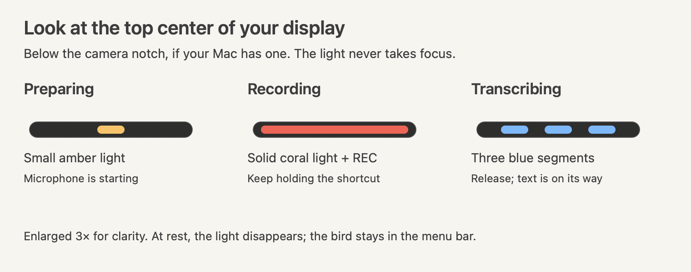
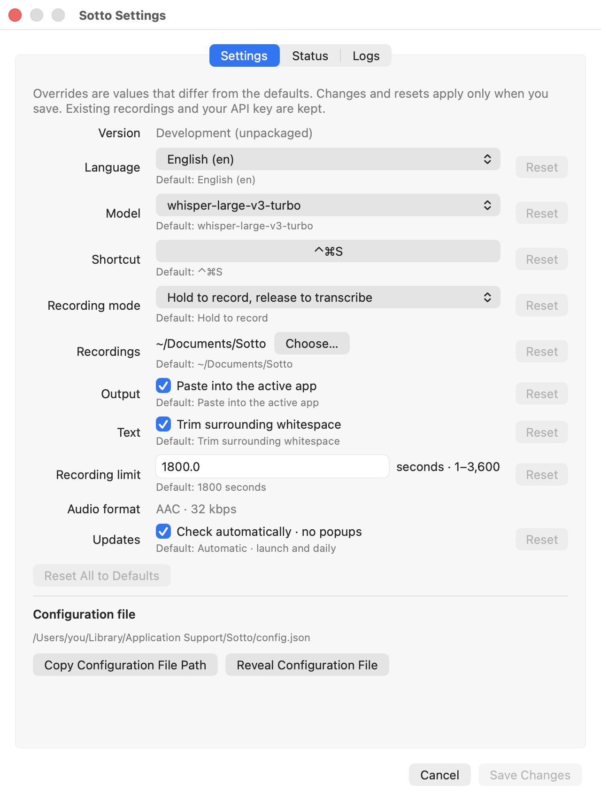

<p align="center">
  
</p>

<h1 align="center">Sotto</h1>

Sotto records your voice, transcribes it with Groq, and copies the text—or pastes it into your active app. It lives in the macOS menu bar and keeps every recording for later reference.

Named after *sotto voce*, “in a quiet voice.” Pronounced **SOH-toh**.

## Get started

**macOS 14+ · Apple silicon and Intel · Bring your own [Groq API key](https://console.groq.com/keys)**

1. [Download the latest app](https://github.com/ben-z/sotto/releases/latest), extract the universal ZIP, and move **Sotto.app** to Applications.
2. Open Sotto. In Settings, paste your Groq key and choose **Save & Check**. If you need a key, **Get a Groq API key** opens the creation page.
3. Allow microphone access and Accessibility for auto-paste. You can turn auto-paste off and paste manually instead.

Your key is stored in macOS Keychain. Audio goes directly to Groq using your account. No Sotto account, Xcode, or Apple Developer account is needed to use the app.

> **First launch:** current releases are ad-hoc signed, not Apple-notarized. If macOS blocks the app, attempt to open it, then use **System Settings → Privacy & Security → Open Anyway** if you trust the download. See [Apple’s instructions](https://support.apple.com/guide/mac-help/open-a-mac-app-from-an-unknown-developer-mh40616/mac).

## Record a thought

Place the cursor where you want the text, **hold Control + Command + S**, speak, then release. Sotto transcribes in English by default and pastes into the active app. Keep that app in front while transcription finishes; if focus changes, your text stays on the clipboard for manual paste.

The indicator is deliberately small: look at the **top center of the display where your pointer was when recording began**, just below the camera notch on Macs that have one. It does not take focus or intercept clicks.

| State | What to look for |
| --- | --- |
| Preparing | A small amber light while the microphone starts. |
| Recording | A continuous coral light. **REC** also appears beside the bird in the menu bar. |
| Transcribing | Three blue segments. The microphone has stopped; wait for the text. |
| Ready | The light disappears. The bird remains in the menu bar. |



<details>
<summary>See the small indicator in context</summary>

**Recording** — a crop of the top of the display:


**Transcribing** — the same position, with three blue segments:


These captures use Sotto’s real indicator over a demo background. The guide above enlarges the drawing 3×; the screen crops retain its proportions. No microphone audio was used to create them.

</details>

Click the bird to see the current state, stop or cancel a recording, copy the last transcript, or open your recordings. Cancelled audio is kept. Sotto transcribes after you stop recording; there is no always-on microphone, local model, or background screen capture.

## Make it yours

Open **Settings…** from the menu. Choose your language, Whisper model, recording folder, recording duration, toggle or hold mode, auto-paste, and whitespace trimming. To change the shortcut, click it and press a new combination; Escape cancels shortcut entry.

Each editable setting shows its default and marks overrides. **Reset** changes one setting; **Reset All to Defaults** changes them all. Choose **Save Changes** to apply, or **Cancel** to discard. Resets keep your key and existing recordings. Command–W closes Settings; Escape leaves it open.

<details>
<summary>Settings screenshot</summary>



Native development UI captured with example paths. See [how the images are generated](docs/images/README.md).

</details>

**Configuration file** has separate actions to copy the JSON file’s path and reveal it in Finder. **Status** guides permission setup and lets you check, replace, or delete your Groq key. Existing saved preferences are preserved when upgrading.

## Quiet updates

Sotto checks GitHub at launch and once daily while running. A newer version appears **inside the menu**, with **Download Sotto…** opening its release page. Download and install updates when you’re ready.

Turn off **Updates** in Settings to disable automatic checks. **Check for Updates** is available beside the version in Settings, including when automatic checks are disabled. Checks send no recordings, transcripts, or Groq key. Check results appear in Settings; the menu shows a download action when an update is ready. If a release is still building, Sotto says its download is being prepared; the download button appears once the app ZIP is ready. Connection failures are also recorded in native logs.

To install an update, finish your recording, quit Sotto, extract the new ZIP, and replace the app in the **same location**. Reopen it. Your key, configuration, and recordings live outside the app and are preserved. Ad-hoc signing means macOS may ask for microphone, Accessibility, or Keychain approval again. If auto-paste stops working, the Status tab explains how to refresh the Accessibility entry.

## Efficiency

Native Swift with no third-party runtime dependencies or local model downloads. The packaged app is small; current sizes and resource measurements are recorded in CI rather than a manually maintained size claim. Retained recordings are separate.

[CI resource reports](https://github.com/ben-z/sotto/actions/workflows/ci.yml) are the regression source of truth: every push and pull request measures the optimized production core on Apple Silicon and Intel with fixed audio fixtures and a local HTTP server. Memory growth, peak footprint, and packaged app size have enforced limits; CPU and raw samples are reported too. This controlled test requires no credentials or microphone and does not measure the menu-bar UI or Groq inference. The [first verified CI baseline](docs/ci-performance-baseline.md) preserves measurements from both runners.

A separate [live app measurement](docs/performance-results.md) on an Apple M4 measured **44.5 MiB idle median** and **45.8 MiB peak during transcription**, across three 15-second microphone recordings. See the [methodology and reproduction commands](docs/performance.md) for scope and limitations. CI and live-app figures describe different workloads and should not be compared directly.

## Your recordings

New recordings go to `~/Documents/Sotto` by default. Each attempt keeps its audio and diagnostic metadata; successful transcriptions also include a text file and the raw Groq response. Failed and cancelled recordings are retained too.

Audio uses compact AAC, approximately **14.4 MB per hour**. Nothing is automatically deleted. Changing the recording folder affects new recordings only.

## Diagnostics

Open **Settings → Logs → Export Logs…** to save a shareable text file of Sotto’s system logs, including build details. Suggested filenames include a UTC timestamp with milliseconds so successive exports stay distinct. **Copy Terminal Command** copies a filtered query that displays logs in Terminal without saving a file. Sotto uses native macOS Unified Logging (subsystem `dev.sotto.app`); macOS controls retention, so a complete 24-hour history is not guaranteed. Export runs only when requested and streams output to a temporary file; there is no background reader or app-managed log rotation. Audio, transcripts, and raw Groq responses stay in your recording folder and are not bundled into the export.

## CLI

```sh
scripts/sotto status
scripts/sotto toggle
scripts/sotto cancel                    # Keep the audio
scripts/sotto transcribe /path/note.m4a  # Import or retry a recording
scripts/sotto config                    # Show the config path
scripts/sotto quit
```

## Development

To build from source, install **Xcode with Swift 6**:

```sh
git clone https://github.com/ben-z/sotto.git
cd sotto
```

A shared `SottoCore` handles recording, transcription, Keychain storage, and files. The macOS interface uses AppKit.

```sh
swift test
scripts/sotto quit   # If running
scripts/build.sh
scripts/launch.sh
```

Development builds are ad-hoc signed, so rebuilding can require permission reapproval. Set `SOTTO_SIGNING_IDENTITY` to an existing signing identity for consistent signing across builds.

An experimental iPhone/iPad app shares the core. Open `iOS/Sotto.xcodeproj` in Xcode; it requires iOS 17+ and still needs device testing.

Successful [CI runs](https://github.com/ben-z/sotto/actions/workflows/ci.yml?query=branch%3Amain) also provide **Sotto-app-ARM64** and **Sotto-app-X64** development artifacts. These require GitHub sign-in; public release downloads do not.

See [validation notes](VALIDATION.md) for measured results and limitations, and [icon sources](design/icon/README.md) for artwork.

## Releases

The [latest release](https://github.com/ben-z/sotto/releases/latest) has the current version. Publishing a new GitHub release automatically runs checks, builds a universal app, and attaches its ZIP and checksum. Personal-use releases need no Apple credentials. Developer ID signing and notarization can be enabled explicitly later; see [RELEASING.md](RELEASING.md).
